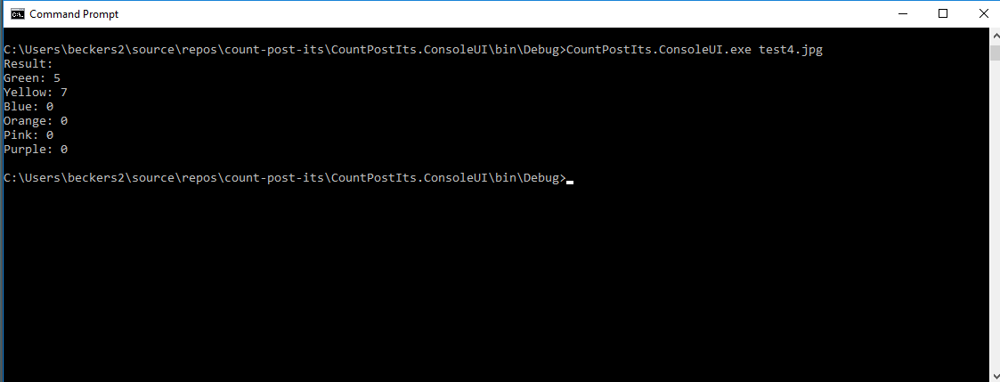
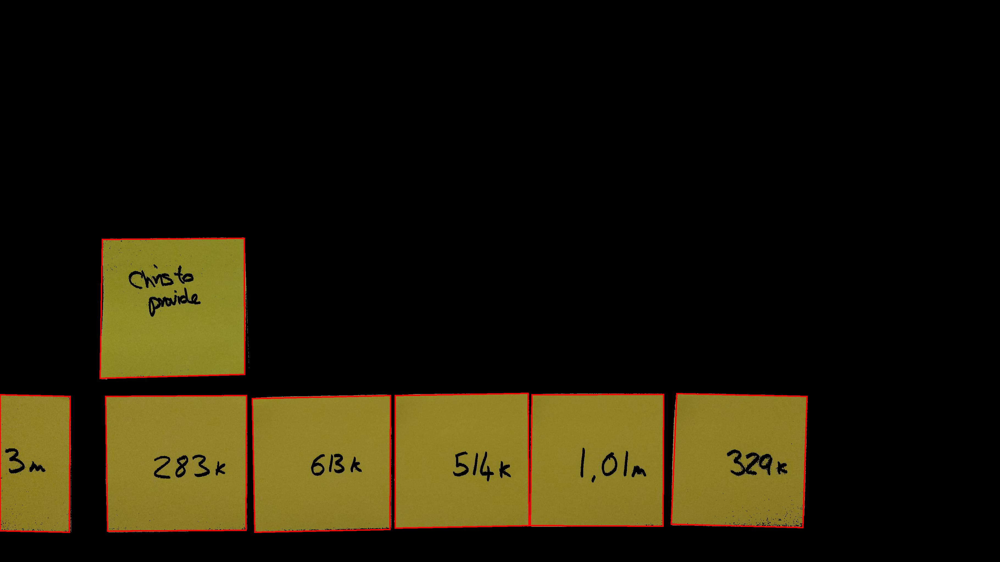
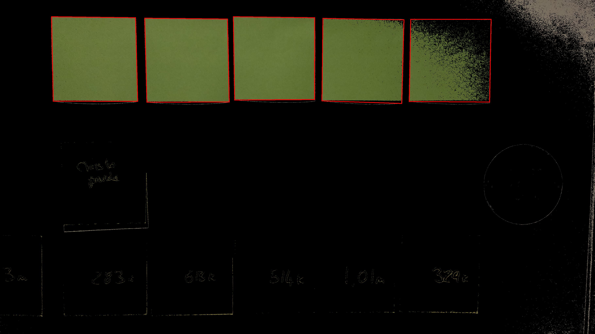

# count-post-its 
change
This app attempts to process an image of a post-it covered wall, outputting the number of post-its grouped by colour. 
It does so using the following techniques:
* Filters the image to exclude that which does not satisfy a predefined RGB constraint (though this may change to an hsl constraint, see 'Todo').
* Uses edge detection to detect quadrilaterals of an allowed width and height.

As such, the app works best when post-it notes **are not overlapping** and when they are against a wall of a different colour to that of the post-its.
It is also imperative that the colours of the post-its used are distinctly different colours. 

This project was built using the [Accord](http://accord-framework.net/) framework, and runs on Windows machines.

## Getting Started

Using a Windows machine, clone the project locally and change into the CountPostIts.ConsoleUi's Debug directory.
```
$ git clone https://github.com/seblexis/count-post-its.git
$ cd count-post-its/CountPostIts.ConsoleUi/bin/Debug
```

Run the executable with the name of the image-file you are testing against.
```
$ CountPostIts.ConsoleUI.exe test3.jpg
```
The result is displayed as shown:


Images are saved for each colour found, highlighting the Post it notes the app has identified, within the ```\images\results``` folder.


  

To analyse your own images, place them in ```CountPostIts.ConsoleUI\Images```  

## Team Members
* [Robbie](https://github.com/racldn)
* [Seb](https://github.com/seblexis)
* [Nathan](https://github.com/NathanQuayle)
* [Ibrahim](https://github.com/ibrahimLexis)

## Todo
* Update program to use HSL values to discriminate instead of RGB values
* Have the executable in a dedicated folder rather than the Debug folder, and have the results images saved in a dedicated folder
* Refine the algorithm to be more robust.


